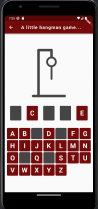

# Hangman Game

[](https://codemagic.io/apps/647ca0717007fae185dff619/647ca0717007fae185dff618/latest_build)

Hangman is a simple word-guessing game built with Flutter.

[🇫🇷 Lire en français](README_FR.md)

## Introduction video :

[Youtube video link !](https://www.youtube.com/watch?v=eGDrX68lhpI&ab_channel=Stecathw)

## Features

- Randomly selects a word for the player to guess.
- Displays the word as a series of blanks representing each letter.
- Allows the player to guess letters and reveals the correct ones.
- Tracks the number of incorrect guesses and displays a hangman drawing.
- Provides feedback on the game's outcome (win or loss).
- Supports multiple languages through localization.

## Environment Variables

Before running the application, make sure to set the following environment variables:

- `API_KEY`: Your API key for accessing external services.
- `API_HOST`: The host URL for the API.

## Getting Started

### Prerequisites

- Flutter SDK (v2.5.0 or higher)
- Dart SDK (v2.14.0 or higher)

### Installation

Clone the repository:

```bash
git clone https://github.com/your-username/hangman.git
```

Navigate to the project directory:

```bash
cd hangman
```

Get the required dependencies:

```bash
flutter pub get
```

### Usage

Run the application:

```bash
flutter run
```

Play the Hangman game by guessing letters to reveal the hidden word.

> **Note**: Make sure you have a connected device or emulator to run the game.

### Localization

The game supports localization in multiple languages (only french and english at the moment). To switch to a different language, update the `supportedLocales` list in the `l10n.dart` file.

### Testing

To run the unit tests, use the following command:

```bash
flutter test
```

To run the integration tests, use the following command:

```bash
flutter drive --target=test_driver/app.dart
```

> **Note**: Make sure you have a connected device or emulator to run the tests.

### Code Analysis and Formatting

The project includes linting and code analysis tools to maintain code quality. Before committing your changes, it is recommended to run the following commands to ensure code correctness:

- Run static analysis using `dart analyze`:

```bash
	dart analyze
```

- Format the code using `dart format`:

```bash
	dart format .
```

> **Note**: The linting stage is configured in the GitHub workflow file.

### GitHub Repository

The GitHub repository for this project can be found at: [Stecathw/hangman](https://https://github.com/Stecathw/hangman)

The repository contains the following branches:

- `main`: The main branch for production-ready code.
- `dev`: The development branch for ongoing development and feature integration.

### Deployment

The project is set up for CodeMagic deployment. You can track the latest build status by clicking on the Codemagic build status badge at the top of this file.

A web version is accessible here : [https://hangman.codemagic.app/](https://hangman.codemagic.app/)

> **Note**: In your navigator, inspect element and make the page responsive. Change the device to a Pixel for best settings.

### Screenshots





### Contributing

Contributions are welcome! If you find any issues or have suggestions for improvements, feel free to open an issue or submit a pull request.

### License

This project is licensed under the [MIT License](LICENSE). Please see the [LICENSE](LICENSE) file for more information.
