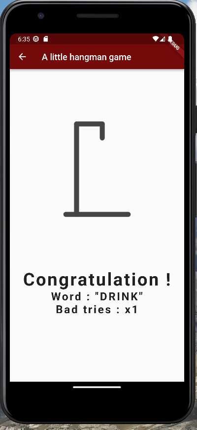
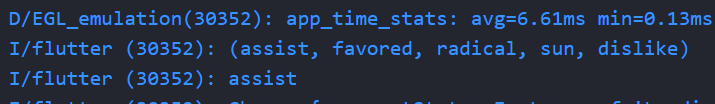

# HANGMAN

Un jeu mobile du pendu.

Les mots à deviner sont en anglais.

## Aperçu global :

+ La page de démarrage :

+ Durant une partie :

+ Si pendu avant de trouver le mot :

+ Si le mot est deviné avant d'être pendu :

+ Pour tricher (mais ce n'est pas drôle...) :

## Genèse :

L'idée du projet est de travailler en collaboration sur une application Flutter 
suite à l'introduction de notions de qualité code source.

Il s'agit donc de mettre en oeuvre et de se poser des questions quant à l'ogranisation du projet, le versionnage, la gestion de l'architecture et l'écriture du code. (principes SOLID)

De même il s'agit pour nous de s'initier au framework Flutter et au language Dart.

## Organisation :

Avant tout développement, nous avons "brainstormé" sur le fonctionnement global de notre pendu et imaginé 
un MVP (Minmal Viable Product) évolutif.

Pour cela nous avons travaillé autour de ce logigramme :

Le projet est versionné avec GIT et enrespectant les standarts sur les commits et les conseils sur la gestion des branches. La branche main de ce projet est donc la version du jeu sortie, les autres branches sont réservées au développement.

## Gestion de l'état :

C'est la partie la plus difficile à prendre en main lorsqu'on démarre avec Flutter. La différence fondamentale avec le web est la reconstruction complète du widget lorsque celui-ci est à l'écoute d'un changement d'état. Au contraire du web où on cherche à avoir de la réactivité sur le ou les seuls élements qui devant changer indépendamments du reste de la page.

Pour gérer l'état de l'application nous utilisations l'architure 3 couches, basée sur le principe Bloc, présentées ici :
https://bloclibrary.dev/#/fluttertodostutorial

Ainsi, la logigue du cubit joue l'intermédiaire entre l'UI et son état et vice versa. 

De plus, le repository permet de joindre une API et en cas de changement de cette dernière nous pouvons facilement adapter notre code (et nous avons dû le faire plusieurs fois avant d'en trouver une correcte et simple).

Nous avons donc utilisé le package flutter_bloc avec les cubit. Voici un schéma représentant le fonctionnement de la requête API sur le principe du Bloc

## DEVELOPPER

## Démarrer le projet :

- Copier le repo : git clone <url>
- Installer les dépendances : flutter get pub
- (optionel) Créer un compte sur rapidAPi (cf ## API) 
- (optionel) Ajouter les variables d'environnements (cf ## Variables d'environnements)
- Lancer le projet localement (optimisé pour un pixel 3a)

## Branches

- main : pour les nouvelles versions seulement
- dev : pour le développement et créer de nouvelles features
- feature/nom-de-la-feature : la nouvelle feature à merge dans la branche dev

## Contribuer au projet :

### Problèmes rencontrés :

Créer une issue ou envoyer un message.

### Développer une feature :

Créer une branche feature/nom-de-la-feature à partir de la branche dev.
Une fois le développement fini faire une demande de merge dans la branche dev.

## API :

Lien vers l'API de mots aléatoires :
https://rapidapi.com/sheharyar566/api/random-words5

Pour tester le jeu sans utiliser d'API (limitée à 250 req/mois), il est possible d'utiliser une fonction donnant une liste de mot en local (getFiveFromLocal() dans le word_repository)

## Variables d'environnements :

A la racine du projet ajouter les variables d'environnements suivantes afin d'avoir des mots alétoires provenant de l'API :

- [API_KEY]  : Your private api key from rapid api
- [API_HOST] : Your private host api url from rapid api

