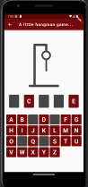
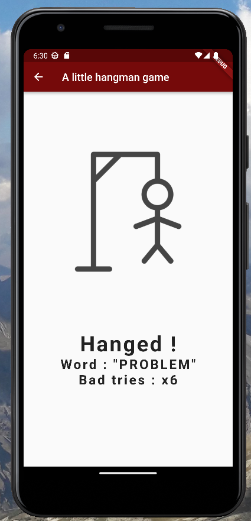

# Jeu du Pendu

[](https://codemagic.io/apps/647ca0717007fae185dff619/647ca0717007fae185dff618/latest_build)

Le Pendu est un jeu de devinette de mots simple développé avec Flutter.

[🇺🇸 Read in English](README.md)

## Fonctionnalités

- Sélectionne aléatoirement un mot pour que le joueur devine.
- Affiche le mot sous forme de séries de tirets représentant chaque lettre.
- Permet au joueur de deviner des lettres et révèle les lettres correctes.
- Compte le nombre de devinettes incorrectes et affiche un dessin du pendu.
- Fournit un retour sur le résultat du jeu (victoire ou défaite).
- Prend en charge plusieurs langues via la localisation.

## Variables d'environnement

Avant de lancer l'application, assurez-vous de définir les variables d'environnement suivantes :

- `API_KEY` : Votre clé API pour accéder aux services externes.
- `API_HOST` : L'URL de l'hôte pour l'API.

## Pour commencer

### Prérequis

- Flutter SDK (version 2.5.0 ou supérieure)
- Dart SDK (version 2.14.0 ou supérieure)

### Installation

Clonez le dépôt :

```bash
git clone https://github.com/your-username/hangman.git
```

Accédez au répertoire du projet :

```bash
cd hangman
```

Obtenez les dépendances requises :

bashCopy code

```bash
flutter pub get
```

### Utilisation

Lancez l'application :

```bash
flutter run
```

Jouez au jeu du Pendu en devinant des lettres pour révéler le mot caché.

> **Remarque** : Assurez-vous d'avoir un appareil connecté ou un émulateur pour exécuter le jeu.

### Localisation

Le jeu prend en charge la localisation dans plusieurs langues (uniquement français et anglais pour le moment). Pour basculer vers une autre langue, mettez à jour la liste `supportedLocales` dans le fichier `l10n.dart`.

### Tests

Pour exécuter les tests unitaires, utilisez la commande suivante :

```bash
flutter test
```

Pour exécuter les tests d'intégration, utilisez la commande suivante :

```bash
flutter drive --target=test_driver/app.dart`
```

> **Remarque** : Assurez-vous d'avoir un appareil connecté ou un émulateur pour exécuter les tests.

### Analyse et formatage du code

Le projet inclut des outils d'analyse et de formatage du code pour maintenir sa qualité. Avant de valider vos modifications, il est recommandé d'exécuter les commandes suivantes pour assurer la correction du code :

- Exécuter l'analyse statique avec `dart analyze` :

```bash
dart analyze
```

- Formater le code avec `dart format` :

```bash
dart format .
```

> **Remarque** : L'étape de linting est configurée dans le fichier de workflow GitHub.

### Dépôt GitHub

Le dépôt GitHub de ce projet se trouve ici : [Stecathw/hangman](https://github.com/Stecathw/hangman)

Le dépôt contient les branches suivantes :

- `main` : La branche principale pour le code prêt à être utilisé en production.
- `dev` : La branche de développement pour les travaux en cours et l'intégration de fonctionnalités.

### Déploiement

Le projet est configuré pour le déploiement avec CodeMagic. Vous pouvez suivre le statut de la dernière construction en cliquant sur le badge de statut de construction Codemagic en haut de ce fichier.

Une version web est accessible ici : [https://hangman.codemagic.app/](https://hangman.codemagic.app/)

> **Remarque** : Dans votre navigateur, utilisez l'inspecteur d'éléments pour rendre la page responsive. Changez l'appareil pour un Pixel pour obtenir les meilleurs réglages.

### Captures d'écran






### Contribuer

Les contributions sont les bienvenues ! Si vous rencontrez des problèmes ou avez des suggestions d'amélioration, n'hésitez pas à ouvrir une issue ou à soumettre une pull request.

### Licence

Ce projet est sous [licence MIT](LICENSE). Veuillez consulter le fichier [LICENSE](LICENSE) pour plus d'informations.
